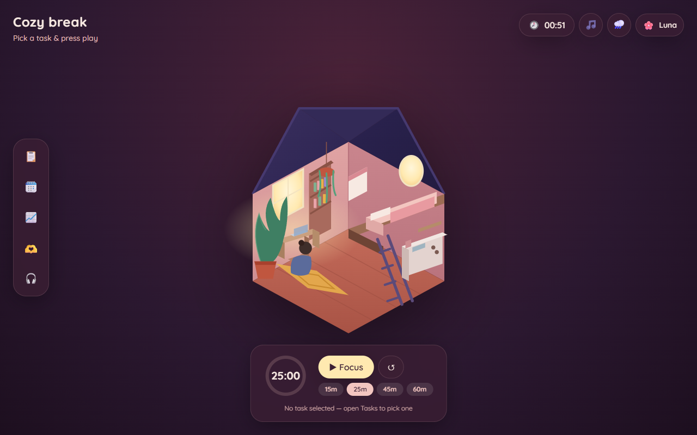

# TaskNook 🏡

> A cozy, full-stack task tracker inspired by the game **Virtual Cottage**.

Curl up in a warm little isometric room, queue up your tasks, and start a focus
block with lofi beats and rain on the window. Watch your productivity garden grow
— and cheer on your friends while you're at it.



---

## Contents

- [Quick start](#-quick-start)
- [Features](#-features)
- [Tech stack](#-tech-stack)
- [API reference](#-api-reference)
- [Project structure](#-project-structure)

---

## 🚀 Quick start

**Prerequisites:** Python 3.10+ and Node 18+.

Run the backend and frontend in two terminals:

**1. Backend** — the Flask REST API on `http://localhost:5000`

```bash
cd backend
pip install -r requirements.txt
python app.py
```

**2. Frontend** — the Vite dev server on `http://localhost:5173`

```bash
cd frontend
npm install
npm run dev
```

Then open **http://localhost:5173** and you're in. 🎉

> [!TIP]
> Click **"peek inside with the demo account"** on the login screen to jump
> straight in — no signup needed. (Demo logins: `luna`, `kai`, `sora`, `mochi`,
> all with password `lofi123`.)

<details>
<summary><b>Run everything on a single port (production mode)</b></summary>

<br>

Build the frontend once, then let Flask serve it alongside the API:

```bash
cd frontend && npm run build      # outputs frontend/dist
cd ../backend && python app.py    # serves the whole app at http://localhost:5000
```

</details>

> [!NOTE]
> On first launch the backend creates `tasknook.db` and seeds a few demo
> cottage-dwellers so the **Friends** panel isn't empty.

---

## ✨ Features

| | Feature | What it does |
|---|---|---|
| 🏡 | **Cozy cottage scene** | A hand-built isometric SVG room (desk, loft bed, kitchen, plants, glowing window) that gently comes alive while you focus. |
| ✅ | **Tasks** | Add tasks with a duration & priority, check them off, and drag to reorder. |
| 🧠 | **Ordering algorithms** | Auto-arrange your list five different ways *(see below)*. |
| ⏱️ | **Focus timer** | Pomodoro-style blocks (15 / 25 / 45 / 60 min) with a progress ring; finished blocks are logged as productivity time. |
| 🗓️ | **Calendar** | Schedule tasks onto specific days and see what's planned. |
| 📈 | **Progress** | A live completion bar, focus-hours, and a "productivity garden" that grows a plant for every 15 focused minutes. |
| 🎧 | **Ambience** | Toggle embedded lofi radio and procedurally-generated rainfall (Web Audio — works offline). |
| 🫶 | **Friends** | Add friends by username and watch each other's daily progress to stay motivated. |

**Ordering algorithms:**

- ✋ **My order** — manual drag-and-drop
- ⚡ **Quick wins first** — shortest duration first
- ⛰️ **Deep work first** — longest first
- 🌊 **Ebb & flow** — alternating short/long to pace yourself
- 🔥 **Priority** — high-priority tasks rise to the top

---

## 🧱 Tech stack

| Layer | Tech |
|---|---|
| **Frontend** | React 18 + Vite · Tailwind CSS · Framer Motion |
| **Backend** | Flask + Flask-SQLAlchemy (SQLite) · token auth · REST API |

The frontend is fully decoupled — it talks to the backend purely over the REST
API under `/api`. In development, Vite proxies `/api` to Flask automatically.

---

## 🔌 API reference

All endpoints live under `/api`. Authenticated routes expect an
`Authorization: Bearer <token>` header (returned by login & register).

### Auth

| Method | Endpoint | Description |
|---|---|---|
| `POST` | `/auth/register` | Create an account, returns a token |
| `POST` | `/auth/login` | Log in, returns a token |
| `GET` | `/auth/me` | Get the current user |

### Tasks

| Method | Endpoint | Description |
|---|---|---|
| `GET` | `/tasks` | List your tasks |
| `POST` | `/tasks` | Create a task |
| `PUT` | `/tasks/:id` | Update (complete, edit, schedule) |
| `PUT` | `/tasks/reorder` | Persist a manual ordering |
| `DELETE` | `/tasks/:id` | Delete a task |

### Progress & social

| Method | Endpoint | Description |
|---|---|---|
| `POST` | `/sessions` | Log a completed focus block |
| `GET` | `/stats` | Today's completion & focus minutes |
| `GET` | `/friends` | List friends + their daily progress |
| `POST` | `/friends` | Add a friend by username |
| `DELETE` | `/friends/:id` | Remove a friend |

---

## 📁 Project structure

```
TaskNook/
├── backend/
│   ├── app.py            # Flask app: routes, seeding, optional static serving
│   ├── models.py         # SQLAlchemy models (User, Task, FocusSession, Token)
│   └── requirements.txt
└── frontend/
    ├── src/
    │   ├── components/    # Cottage, TopBar, FocusTimer, panels, Drawer, Dock…
    │   ├── lib/           # api client, ordering algorithms, ambient audio
    │   ├── store.jsx      # React context: auth, tasks, timer, ambience
    │   └── App.jsx
    └── vite.config.js
```

---

<div align="center">

Made cozy with 🌙 and lofi.

</div>
