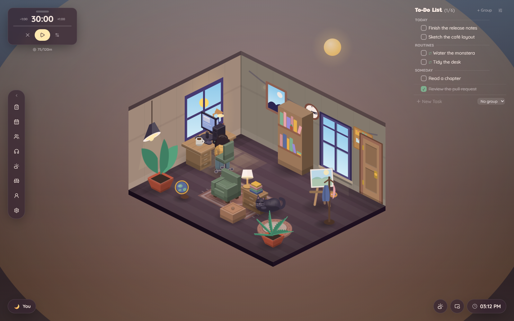

# TaskNook 🏡

> A cozy, full-stack task tracker inspired by the game **Virtual Cottage**.

Settle into a little isometric room of your own, queue up your tasks, and start
a focus block with lofi beats and rain, snow, or a full storm outside. Decorate
the place, draw your own floor plan, and let someone live there. Switch the
scene between night, sunset, and day — or let TaskNook check the real weather
where you are and match it automatically. Watch your productivity garden grow
— and cheer on your friends while you're at it.



> More of it: **[screenshots](docs/screenshots/)** — every room preset, the
> weather modes, and the panels.

> **Just want to use it?** Download **`TaskNook.exe`** from the repo root and
> double-click it — that's the whole app in one file, no Python or Node needed.
> (macOS: clone the repo and run **`TaskNook.command`**.)

---

## Contents

- [Quick start](#-quick-start)
- [Run as a desktop app](#-run-as-a-desktop-app)
- [Features](#-features)
- [Tech stack](#-tech-stack)
- [Project structure](#-project-structure)

---

## 🚀 Quick start

**Prerequisites:** Python 3.10+ and Node 18+.

Run the backend and frontend in two terminals:

**1. Backend** — the Flask REST API on `http://localhost:5000`

```bash
cd backend
pip install -r requirements.txt
python app.py
```

**2. Frontend** — the Vite dev server on `http://localhost:5173`

```bash
cd frontend
npm install
npm run dev
```

Then open **http://localhost:5173** and you're in. 🎉

---

## 🖥️ Run as a desktop app

TaskNook can also run as a **native desktop application** — its own window, no
browser tab. It boots the Flask server locally and opens it in an OS window
(via [pywebview](https://pywebview.flowrl.com/); Windows uses the built-in
WebView2 runtime, macOS uses WebKit).

**One-click launch:**

| Platform | File | Notes |
|---|---|---|
| Windows | **`TaskNook.exe`** | Standalone — Python, the server and the app are all bundled inside. Nothing to install. |
| macOS | **`TaskNook.command`** | Needs Python + Node. First time: `chmod +x TaskNook.command`. |
| Linux | `TaskNook.command` | Also needs system WebKit, e.g. `sudo apt install python3-gi gir1.2-webkit2-4.1`. Without it, TaskNook falls back to opening in your browser. |

Your tasks and settings live in `%LOCALAPPDATA%\TaskNook\`, so they survive
closing the app — and updating the exe.

**Or run it manually:**

```bash
# one-time setup
cd frontend && npm install && npm run build && cd ..
pip install -r requirements-desktop.txt

# launch the native window
python desktop.py
```

<details>
<summary><b>Package it into a single <code>TaskNook.exe</code> (optional, Windows)</b></summary>

<br>

Bundle everything — Python, the server, and the built SPA — into one
double-clickable executable with [PyInstaller](https://pyinstaller.org/).

**Easiest:** run `build-exe.bat` from the repo root. It builds the frontend,
installs `requirements-desktop.txt` + `pyinstaller`, and packages `desktop.py`
into **`TaskNook.exe`** at the repo root (one file, no console window),
replacing the existing one.

It overwrites **`TaskNook.exe` at the repo root** — which is committed on
purpose, so visitors can download and run it without building anything. Your
tasks live in `%LOCALAPPDATA%\TaskNook\tasknook.db`, never inside the
read-only bundle, so replacing the exe never touches your data.

> **The PyInstaller flags in `build-exe.bat` are the authoritative list — read
> them there rather than copying them here** (this README has drifted from
> them twice already). They aren't optional decoration:
>
> `backend/` and `frontend/dist` ship as **loose data files**, not analyzed as
> source — `desktop.py` adds `backend/` to `sys.path` and imports `app.py` at
> runtime, exactly as it does unfrozen. So PyInstaller's analyzer never sees
> anything the backend imports, and each one needs an explicit
> `--hidden-import` / `--collect-all`. Miss one and the exe fails **only at
> runtime, silently** — `--windowed` has no console to print the traceback to.
>
> The backend is bundled file-by-file rather than as a whole folder, so your
> local `tasknook.db` and its backups can't be published inside the binary.
>
> After changing anything there, prove the artifact still works:
> `set TASKNOOK_SELFTEST=1 && TaskNook.exe` → exit code must be `0`. CI runs
> this on every push for exactly this reason.

</details>

---

## ✨ Features

| | Feature | What it does |
|---|---|---|
| 🏡 | **Cozy desk scene** | A hand-built flat SVG scene — a desk by a rainy window — with a glowing monitor, desk lamp and string lights that dim and brighten with the time of day. Opening the app pulls back from a peek through the window. |
| ✅ | **Tasks, groups & routines** | Add tasks with a duration & priority, check them off, and drag to reorder — organised under named groups right in the on-screen to-do list. Mark a task ↻ as a daily routine and it un-checks itself each morning. |
| 🧠 | **Ordering algorithms** | Auto-arrange your list five different ways *(see below)*. |
| ⏱️ | **Focus timer, Pomodoro & stopwatch** | Always on screen as a cozy HUD: a compact transport-style timer card top-left (durations, Pomodoro plan and mode tucked behind ⚙, −1:00/+1:00 nudges mid-session), to-do list top-right, and a collapsible side menu so the scene can breathe. Focus blocks (15 / 25 / 45 / 60 min); flip on 🍅 **Pomodoro mode** for automatic focus → break rounds, or switch to **stopwatch** to count up open-ended — finished time is logged either way. Quick-add tasks right from the HUD. |
| 🎯 | **Daily goal & streak** | Set a daily focus target (1–4h) and watch the goal ring fill; every goal-met day extends your 🔥 streak. The essentials sit right under the timer. |
| 🗓️ | **Calendar** | Schedule tasks onto specific days and see what's planned. |
| 📈 | **Progress** | A live completion bar, focus-hours, and a "productivity garden" that grows a plant for every 15 focused minutes. |
| 🎵 | **Music** | Built-in lofi YouTube stations, or paste any YouTube or Spotify link (playlist/album/track/show/episode) to play your own — controlled from a little transport bar at the bottom of the screen (play/pause, skip tracks in a playlist, a seek bar with the current song's title, volume) that keeps playing whatever panels you close. |
| 🌦️ | **Ambient sound mixer** | Rain (with real droplet patter), storm, snow, wind, a crackling fireplace, birdsong — procedurally generated with the Web Audio API (fully offline) and mixable: layer as many as you like, each with its own volume. Weather scenes set the visuals only, so a rainy window can stay silent if you like. |
| 🕰️ | **Day / sunset / night** | Switch the scene's lighting — sky color, city lights, and a sun or moon — to match the mood you want. The whole backdrop joins in: twinkling stars and a glowing moon at night, a warm sun by day, and drifting clouds on cloudy days (storm-dark when it pours). |
| 🌍 | **Real weather** | A built-in weather panel shows the actual current conditions where you are (via [Open-Meteo](https://open-meteo.com/), free & keyless) — geolocation first, manual city search as a fallback. "Match my real weather" auto-syncs the ambience and time of day to reality. |
| 🛋️ | **Decorate your room** | Freeform decoration: drag 20+ items — plants, rugs, lamps, posters, a sleeping cat — literally anywhere, recolour each one (swatches, hex code, or full hue/saturation/lightness sliders), and resize the whole room to taste. Start from a preset (Classic, Greenhouse, Library, Night owl) and make it yours. Everything is free; your layout is saved in the database. |
| 🧊 | **Isometric room** | The main scene: a Sims-style 3D room that fills the screen — scroll to zoom, drag to look around, double-click to recenter. **Draw your own floor plan**: drag across a grid to paint tiles in or out and the walls follow any shape you make. Drag furniture (sofas, beds, pianos, aquariums — 90+ pieces, sorted into browsable sections) across the tile grid with half-tile snapping, ⟳ rotate it to face the other way, hang frames/shelves/mirrors on the walls, recolour anything, and resize the floor itself from 3×3 all the way up to a 48×48 lot. Small things rest on whatever you put them on: a mug lands on the table top, a lamp on the desk. Change the **setting** too — room, café, library, terrace or an open-air garden that swaps walls for sky, grass, ponds and trees. Start from a preset — an L-shaped Loft, Cozy study, Cozy cabin, Morning café, Corner café, Reading room, Terrace, Secret garden, or an empty room — and make it yours. It keeps its own layout alongside the classic scene. |
| 🧍 | **A resident** | Drop a little person into your room — set them on a stool, sofa, bench or bed and they sit (properly, legs out); leave them on the floor and they wander on their own, politely walking around your furniture. While a focus block runs, a seated resident types. Recolour their sweater like anything else. |
| 🐾 | **Pets that live here** | A cat, a dog and a rabbit that wander the room on their own, pick their way around the furniture, and curl up asleep when they find a rug, a blanket or a pet bed. |
| 🫶 | **Friends** | See everyone's daily progress to stay motivated — TaskNook auto-friends your local account with a few demo cottage-dwellers so it's never empty. |

**Ordering algorithms:**

- ✋ **My order** — manual drag-and-drop
- ⚡ **Quick wins first** — shortest duration first
- ⛰️ **Deep work first** — longest first
- 🌊 **Ebb & flow** — alternating short/long to pace yourself
- 🔥 **Priority** — high-priority tasks rise to the top

**Roadmap** (not built yet, in no particular order):

- 🧑‍🤝‍🧑 **Multiplayer study rooms** — focus alongside friends in a shared cottage. Big one: TaskNook is currently a fully local single-user app, so this needs a real server story first.

---

## 🧱 Tech stack

| Layer | Tech |
|---|---|
| **Frontend** | React 18 + Vite · Tailwind CSS · Framer Motion |
| **Backend** | Flask + Flask-SQLAlchemy (SQLite) · Alembic migrations (Flask-Migrate) · token auth · REST API |
| **Tests/CI** | Vitest (frontend) · pytest (backend) · GitHub Actions — including a smoke test that boots the real `.exe` |
| **External** | [Open-Meteo](https://open-meteo.com/) for real weather (free, no API key) — the only feature that needs internet; everything else is fully local |

The frontend is fully decoupled — it talks to the backend purely over the REST
API under `/api`. In development, Vite proxies `/api` to Flask automatically.

---

## 📁 Project structure

Everything a user needs sits at the repo root: the app itself and the launchers.
The source lives in `backend/` + `frontend/`.

```
TaskNook/
├── TaskNook.exe              # ⭐ Windows: double-click → the whole app, standalone
├── TaskNook.command          # ⭐ macOS/Linux one-click launcher (needs Python + Node)
├── build-exe.bat             # Rebuilds TaskNook.exe from source
├── desktop.py                # Native-window launcher (pywebview + waitress)
├── requirements-desktop.txt  # Desktop-app Python deps (pulls in backend deps too)
├── README.md
├── CLAUDE.md                 # Deep-dive guide to the codebase (for contributors & AI tools)
├── docs/
│   └── preview.png           # The screenshot at the top of this README
│
├── backend/                  # Flask REST API (SQLite, fully local)
│   ├── app.py                # Routes, token auth, demo seeding, static serving
│   ├── models.py             # SQLAlchemy models (User, Task, FocusSession, Token)
│   ├── schema.py             # Startup migration + pre-upgrade backup lifecycle
│   ├── migrations/           # Alembic history — the source of truth for the schema
│   ├── tests/                # pytest: the schema/upgrade guarantees
│   └── requirements.txt      # Backend Python deps
│
└── frontend/                 # React 18 + Vite single-page app
    ├── index.html
    ├── vite.config.js        # Dev server; proxies /api → Flask :5000
    ├── tailwind.config.js    # The cozy color palette
    └── src/
        ├── main.jsx          # Entry point
        ├── App.jsx           # Shell: scene, dock, panels, timer, intro animation
        ├── store.jsx         # Single source of truth (React Context)
        ├── index.css         # Tailwind layers + shared styles
        ├── components/
        │   ├── Cottage.jsx        # The hand-built SVG desk scene
        │   ├── TopBar.jsx, Dock.jsx, Drawer.jsx, FocusTimer.jsx
        │   ├── TaskPanel, CalendarPanel, ProgressPanel, FriendsPanel,
        │   │   MusicPanel, WeatherPanel, SettingsPanel (.jsx)
        │   └── WeatherOverlay.jsx # Full-screen rain / snow / storm visuals
        └── lib/
            ├── api.js             # Fetch wrapper (bearer-token auth)
            ├── algorithms.js      # Task-ordering strategies (pure functions)
            ├── audio.js           # Procedural rain/snow/storm (Web Audio API)
            ├── weather.js         # Open-Meteo real-weather client
            └── musicLink.js, youtube.js, spotify.js  # Music-link parsing
```

> After building the desktop app you'll also see `build/`, `dist/`, and
> `TaskNook.spec` locally — those are PyInstaller artifacts and are gitignored.

---

<div align="center">

Made cozy with 🌙 and lofi.

</div>
