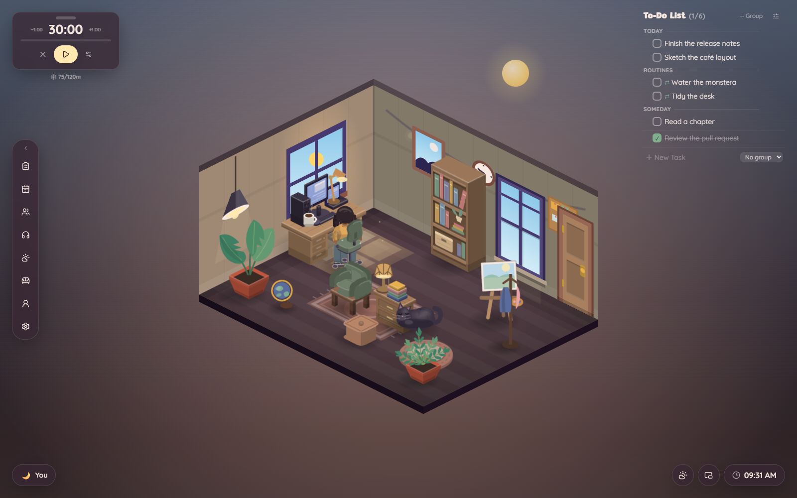

# TaskNook

> A cozy, full-stack task tracker inspired by the game **Virtual Cottage**.

Settle into a little isometric room of your own, queue up your tasks, and start
a focus block with lofi beats and rain, snow, or a full storm outside. Decorate
the place, draw your own floor plan, and let someone live there. Switch the
scene between night, sunset, and day — or let TaskNook check the real weather
where you are and match it automatically. Build a study habit with challenges,
profile levels and a calendar of your focus history, or settle into a common
place with simulated neighbours.



> More of it: **[screenshots](docs/screenshots/)** — every room preset, the
> weather modes, visiting a friend, and the panels.

> **Just want to use it?** Download **`TaskNook.exe`** from the repo root and
> double-click it — that's the whole app in one file, no Python or Node needed.
> (macOS: clone the repo and run **`TaskNook.command`**.)

---

## Contents

- [Quick start](#quick-start)
- [Run as a desktop app](#run-as-a-desktop-app)
- [Features](#features)
- [Tech stack](#tech-stack)
- [Project structure](#project-structure)
- [Documentation](docs/README.md)

---

## Quick start

**Prerequisites:** Python 3.10+ and Node 18+.

Run the backend and frontend in two terminals:

**1. Backend** — the Flask REST API on `http://localhost:5000`

```bash
cd backend
pip install -r requirements.txt
python app.py
```

**2. Frontend** — the Vite dev server on `http://localhost:5173`

```bash
cd frontend
npm install
npm run dev
```

Then open **http://localhost:5173** and you're in.

---

## Run as a desktop app

TaskNook can also run as a **native desktop application** — its own window, no
browser tab. It boots the Flask server locally and opens it in an OS window
(via [pywebview](https://pywebview.flowrl.com/); Windows uses the built-in
WebView2 runtime, macOS uses WebKit).

**One-click launch:**

| Platform | File | Notes |
|---|---|---|
| Windows | **`TaskNook.exe`** | Standalone — Python, the server and the app are all bundled inside. Nothing to install. |
| macOS | **`TaskNook.command`** | Needs Python + Node. First time: `chmod +x TaskNook.command`. |
| Linux | `TaskNook.command` | Also needs system WebKit, e.g. `sudo apt install python3-gi gir1.2-webkit2-4.1`. Without it, TaskNook falls back to opening in your browser. |

On Windows, your tasks and settings live in `%LOCALAPPDATA%\TaskNook\`, so
they survive closing the app and updating the exe. Other platforms use the
local data directory selected by `desktop.py`.

**Or run it manually:**

```bash
# one-time setup
cd frontend && npm install && npm run build && cd ..
pip install -r requirements-desktop.txt

# launch the native window
python desktop.py
```

<details>
<summary><b>Package it into a single <code>TaskNook.exe</code> (optional, Windows)</b></summary>

<br>

Bundle everything — Python, the server, and the built SPA — into one
double-clickable executable with [PyInstaller](https://pyinstaller.org/).

**Easiest:** run `build-exe.bat` from the repo root. It builds the frontend,
installs `requirements-desktop.txt` + `pyinstaller`, and packages `desktop.py`
into **`TaskNook.exe`** at the repo root (one file, no console window),
replacing the existing one.

It overwrites **`TaskNook.exe` at the repo root** — which is committed on
purpose, so visitors can download and run it without building anything. Your
tasks live in `%LOCALAPPDATA%\TaskNook\tasknook.db`, never inside the
read-only bundle, so replacing the exe never touches your data.

**Update notifications:** packaged builds check the `main` branch for a newer
build in the background on every launch, then every six hours while open.
Startup checks run even if the previous launch checked recently.
An available update offers to open the executable download in your browser.
Close TaskNook, replace the old executable with the downloaded one, and reopen
it; tasks and settings stay in `%LOCALAPPDATA%\TaskNook`. Cancelling keeps the
app running and postpones the next reminder for a day. Offline checks quietly
retry later. This is a download reminder, not an automatic installer.
Copies from before this feature need one manual update to gain notifications.

**Publishing an update:** run `build-exe.bat`, then commit and push
**both `TaskNook.exe` and `desktop-update.json` in the same commit** to `main`.
The script stamps the executable with its build identity and generates the
matching manifest only after packaging succeeds. Ordinary source/docs pushes
without a new build do not trigger a notification. No GitHub Release or token
is required. For a separate development build, set
`TASKNOOK_UPDATE_CHANNEL=dev` before building and publish both files to `dev`;
that executable follows `dev`. The default stays `main` even when building
from a local development branch. Set `TASKNOOK_NO_UPDATE_CHECK=1` when launching
to disable checks. Source launches and `TASKNOOK_SELFTEST` never check online.

> **The PyInstaller flags in `build-exe.bat` are the authoritative list — read
> them there rather than copying them here** (this README has drifted from
> them twice already). They aren't optional decoration:
>
> `backend/` and `frontend/dist` ship as **loose data files**, not analyzed as
> source — `desktop.py` adds `backend/` to `sys.path` and imports `app.py` at
> runtime, exactly as it does unfrozen. So PyInstaller's analyzer never sees
> anything the backend imports, and each one needs an explicit
> `--hidden-import` / `--collect-all`. Miss one and the exe fails **only at
> runtime, silently** — `--windowed` has no console to print the traceback to.
>
> The backend is bundled file-by-file rather than as a whole folder, so your
> local `tasknook.db` and its backups can't be published inside the binary.
>
> After changing anything there, prove the artifact still works:
> `set TASKNOOK_SELFTEST=1 && TaskNook.exe` → exit code must be `0`. CI runs
> this on every push for exactly this reason.

</details>

---

## Features

| Feature | What it does |
|---|---|
| **Cozy desk scene** | A hand-built flat SVG scene — a desk by a rainy window — with a glowing monitor, desk lamp and string lights that dim and brighten with the time of day. Opening the app pulls back from a peek through the window. |
| **Tasks, groups & routines** | Add tasks with a duration & priority, check them off, and drag to reorder — organised under named groups right in the on-screen to-do list. Mark a task ↻ as a daily routine and it un-checks itself each morning. |
| **Ordering algorithms** | Keep your manual order or sort by duration, priority, deadline or a saved shuffle *(see below)*. |
| **Focus timer, Pomodoro & stopwatch** | Always on screen as a cozy HUD: a compact transport-style timer card top-left (durations, Pomodoro plan and mode tucked behind ⚙, −1:00/+1:00 nudges mid-session), to-do list top-right, and a collapsible side menu so the scene can breathe. Focus blocks (15 / 25 / 45 / 60 min); switch on Pomodoro mode for automatic focus → break rounds, or switch to **stopwatch** to count up open-ended — finished time is logged either way. Quick-add tasks right from the HUD. |
| **Daily goal & streak** | Set a daily focus target (1–4h) and watch the goal ring fill; every goal-met day extends your streak. The essentials sit right under the timer. |
| **Calendar** | Schedule tasks and appointments, see completed tasks and focus sessions by day, and compare your weekly focus history. |
| **Challenges** | Three daily prompts vary across studying, tasks and social activities. Replace a prompt that doesn't fit, or write a personal goal with manual or automatic progress. Personal goals can reset daily or continue across days. Progress persists on this device; completing a goal earns profile XP. |
| **Profile levels** | Saved study time, completed challenges, NPC interactions and daily check-in streaks earn XP. Levels start at 100 XP and each next level needs 50 more. See your level, XP bar and login streak in Profile. |
| **Progress** | List completion and daily focus goals live in Tasks; the calendar shows focus history, daily breakdowns and weekly summaries. |
| **Music** | Built-in lofi YouTube stations, or paste any YouTube or Spotify link (playlist/album/track/show/episode) to play your own — controlled from a little transport bar at the bottom of the screen (play/pause, skip tracks in a playlist, a seek bar with the current song's title, volume) that keeps playing whatever panels you close. Click the song title to open it on YouTube or Spotify, and fold the whole bar away to a single pill when you want a clear view — the music plays on. |
| **Ambient sound mixer** | Rain, storm, snow, wind, a crackling fireplace, café sounds and page turns — procedurally generated with the Web Audio API and fully offline. Layer channels with separate volumes. Weather scenes set the visuals only, so a rainy window can stay silent. |
| **Day / sunset / night** | Switch the scene's lighting — sky color, city lights, and a sun or moon — to match the mood you want. The whole backdrop joins in: twinkling stars and a glowing moon at night, a warm sun by day, and drifting clouds on cloudy days (storm-dark when it pours). |
| **Real weather** | A built-in weather panel shows the actual current conditions where you are (via [Open-Meteo](https://open-meteo.com/), free & keyless) — geolocation first, manual city search as a fallback. "Match my real weather" auto-syncs the ambience and time of day to reality. |
| **Classic cottage** | An alternative flat SVG desk scene with freeform decoration, recolourable furniture and city, woodland or seaside window views. Start from Classic study, Greenhouse, Library, Night owl, Woodland nook or Seaside studio; its layout is saved separately from the isometric home. |
| **Isometric room** | The default scene uses hand-authored SVG models on a dimetric grid. Zoom, pan and recenter; paint a custom floor plan, resize it from 3×3 to 48×48, and arrange furniture with half-tile snapping and supported rotations. The catalog has 161 entries across 18 groups, with tabletop stacking, wall decorations, recolouring and seasonal pieces. Choose an indoor room, café, library, terrace or garden. Presets include Loft, Shared home, Cozy study, Cozy cabin, Reading room, Study hall, Corner café, Plant shop, Terrace, Secret garden, seasonal yards, Poolside and an empty room. |
| **Character & residents** | Customize your character's body, face, hair, clothing and accessories, or start from one of eight complete looks. People stay where you settle them: carry them onto a chair, soft ground or a clear floor spot. Seated focus and break poses follow activity; pets provide the wandering motion. |
| **Timer widget** | On Windows, Widget Mode becomes a borderless 340×300 timer. Drag its header to move it; expand or press Escape to return to your room with the timer intact. The desktop Always On Top toggle keeps it above other windows. Browser mode offers the compact timer inside the page. |
| **Pets that live here** | A cat, a dog and a rabbit that wander the room on their own, pick their way around the furniture, and curl up asleep when they find a rug, a blanket or a pet bed. |
| **Friends & chat** | Local simulated neighbours have daily activity, productivity, chat choices and friendship levels. Visit their rooms or receive drop-ins at home. The local account starts with four demo friends; these are NPCs, not other installations. |
| **Common places** | Join Common Cottage or Willow Pond, each with authored furniture, multiple floor heights and six seats. Three NPC neighbours are already there; choose an open seat. Common places have fixed decoration and leave your home layout unchanged. |

**Ordering algorithms:**

- **My order** — manual drag-and-drop
- **Quick wins first** — shortest duration first
- **Deep work first** — longest first
- **Ebb & flow** — alternating short/long to pace yourself
- **Priority** — high-priority tasks rise to the top
- **Due soon** — nearest deadlines first
- **Random** — keep a shuffled order; click again to reshuffle

**Roadmap** (not built yet, in no particular order):

- **Multiplayer study rooms** — focus alongside friends in a shared cottage. Big one: TaskNook is currently a fully local single-user app, so this needs a real server story first.

---

## Tech stack

| Layer | Tech |
|---|---|
| **Frontend** | React 18 + Vite · Tailwind CSS · Framer Motion |
| **Backend** | Flask + Flask-SQLAlchemy (SQLite) · Alembic migrations (Flask-Migrate) · token auth · REST API |
| **Tests/CI** | Vitest (frontend) · pytest (backend) · GitHub Actions — including a smoke test that boots the real `.exe` |
| **Optional online services** | [Open-Meteo](https://open-meteo.com/) for real weather, YouTube/Spotify for streamed music, and GitHub for desktop update checks. Tasks, rooms, NPC interactions, challenges and generated ambience run locally. |

The frontend is fully decoupled — it talks to the backend purely over the REST
API under `/api`. In development, Vite proxies `/api` to Flask automatically.

---

## Project structure

Everything a user needs sits at the repo root: the app itself and the launchers.
The source lives in `backend/` + `frontend/`.

```
TaskNook/
├── TaskNook.exe              # Windows: double-click → the whole app, standalone
├── TaskNook.command          # macOS/Linux one-click launcher (needs Python + Node)
├── build-exe.bat             # Rebuilds TaskNook.exe from source
├── desktop.py                # Native-window launcher (pywebview + waitress)
├── requirements-desktop.txt  # Desktop-app Python deps (pulls in backend deps too)
├── README.md
├── AGENTS.md                 # Canonical contributor and assistant guidance
├── CLAUDE.md                 # Entry point to the same guidance for Claude tools
├── docs/
│   ├── README.md             # Current guides and historical review index
│   ├── screenshots/          # App screenshots and model closeups
│   └── preview.png           # The screenshot at the top of this README
│
├── backend/                  # Flask REST API (SQLite, fully local)
│   ├── app.py                # Routes, token auth, demo seeding, static serving
│   ├── models.py             # Users, tasks, focus sessions, tokens, chats, calendar events
│   ├── schema.py             # Startup migration + pre-upgrade backup lifecycle
│   ├── migrations/           # Alembic history — the source of truth for the schema
│   ├── tests/                # pytest: the schema/upgrade guarantees
│   └── requirements.txt      # Backend Python deps
│
└── frontend/                 # React 18 + Vite single-page app
    ├── index.html
    ├── vite.config.js        # Dev server; proxies /api → Flask :5000
    ├── tailwind.config.js    # The cozy color palette
    └── src/
        ├── main.jsx          # Entry point
        ├── App.jsx           # Shell: scene, dock, panels, timer, intro animation
        ├── store.jsx         # Single source of truth (React Context)
        ├── timer.jsx         # Separate timer provider and status context
        ├── index.css         # Tailwind layers + shared styles
        ├── components/
        │   ├── Cottage.jsx, IsoRoom.jsx, CommonRoom.jsx  # Scene renderers
        │   ├── HudFocusCard.jsx, FocusWidget.jsx, HudTasks.jsx
        │   ├── TopBar.jsx, Dock.jsx, Drawer.jsx
        │   ├── TaskPanel, CalendarPanel, FriendsPanel, ChallengesPanel,
        │   │   MusicPanel, WeatherPanel, RoomPanel, ProfilePanel, SettingsPanel (.jsx)
        │   └── WeatherOverlay.jsx # Full-screen rain / snow / storm visuals
        └── lib/
            ├── api.js             # Fetch wrapper (bearer-token auth)
            ├── storage.js         # Guarded browser-storage gateway
            ├── algorithms.js      # Task-ordering strategies (pure functions)
            ├── audio.js           # Procedural rain/snow/storm (Web Audio API)
            ├── weather.js         # Open-Meteo real-weather client
            ├── isoRoom.js, isoPresets.js, commonRooms.js  # Room data and geometry
            ├── challenges.js, progression.js  # Challenge and profile-XP rules
            └── musicLink.js, youtube.js, spotify.js  # Music-link parsing
```

> Generated files live in `frontend/dist/`, `frontend/art-sheet/` and `build/`;
> PyInstaller also creates `TaskNook.spec`. These are gitignored. The shipping
> `TaskNook.exe` and its matching `desktop-update.json` are committed on purpose.

---

<div align="center">

Made cozy, with lofi playing in the background.

</div>
