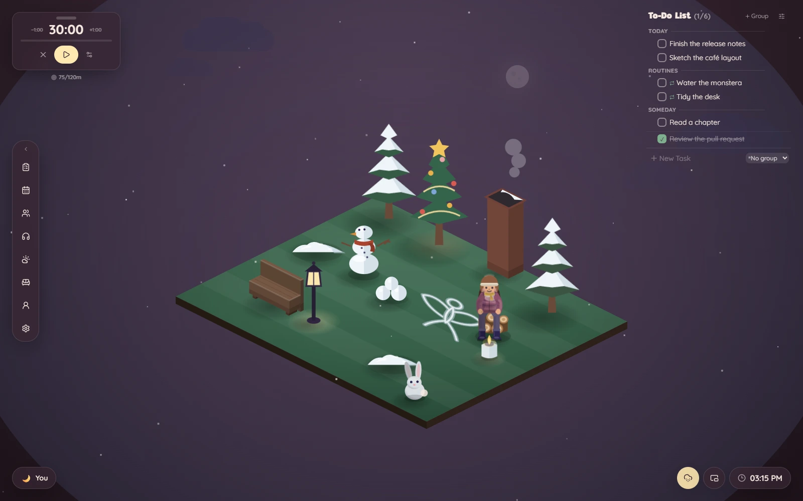
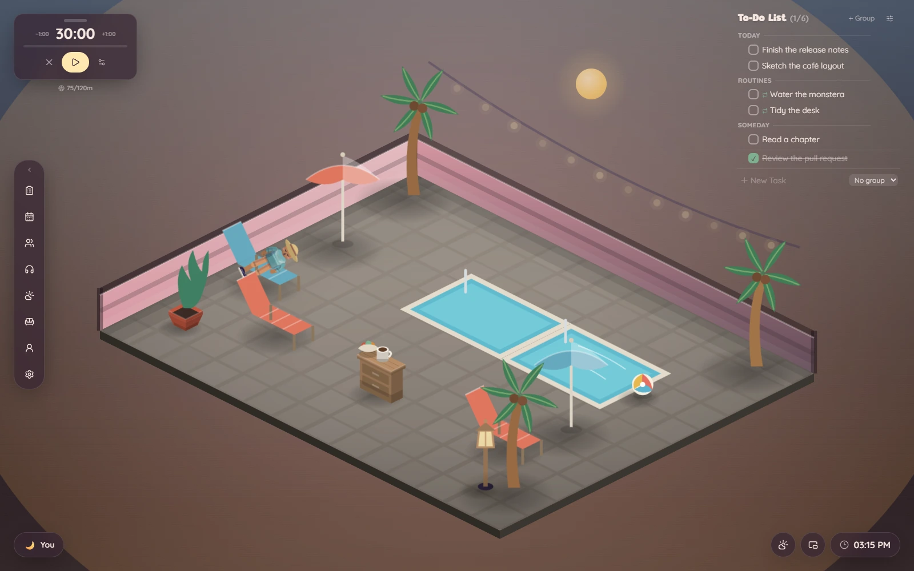
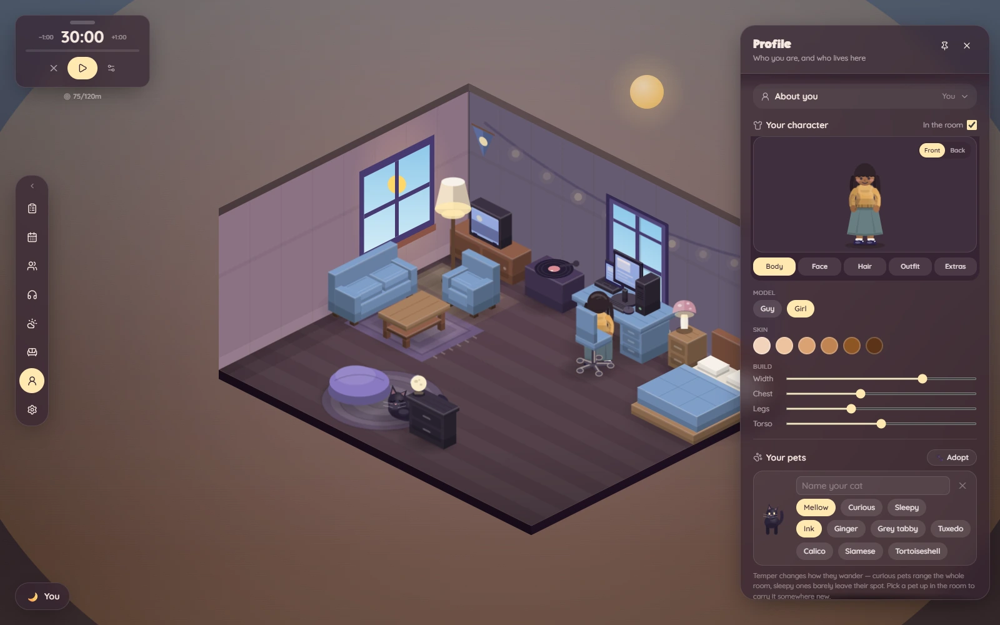
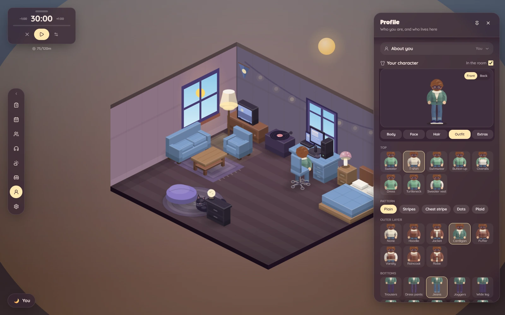
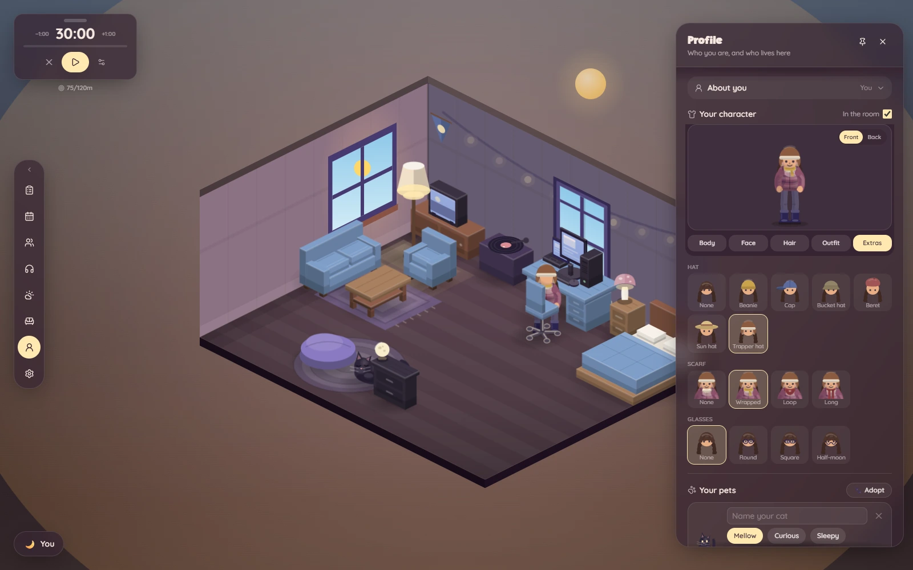
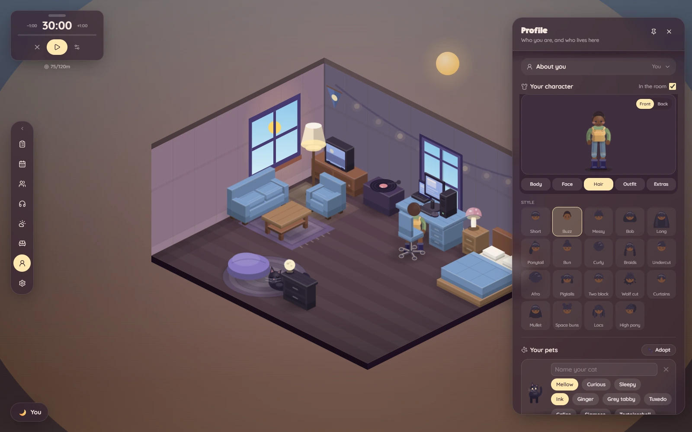

# TaskNook — screenshots

Captured by driving the real app in a headless browser, not mocked up: every
shot is the built SPA talking to the Flask API, with tasks and focus sessions
created through the actual REST endpoints, and rooms applied by clicking the
same preset buttons you would. 1600×1000 WebP.

Regenerate them with `frontend/scripts/screenshots.mjs` — the capture pipeline
is committed rather than rebuilt from scratch each time, and its header carries
the traps (cache-busting, re-enabling the Page domain after a navigation, and
running the backend against a throwaway `TASKNOOK_DB` so focus minutes don't
accumulate between runs).

The README's hero image is `../preview.png` — the same capture, as PNG.

Refreshed September 22, 2026. The room gallery rotates through six saved
character looks, covering both body models, different builds and skin tones,
hairstyles, layered outfits, skirts, denim, winter clothing and swimwear.
These are ordinary profile selections, saved through the app's profile API.
The “In the room” toggle seats your character using the app's placement rules.
The weather comparison keeps one character and one room throughout.

## Rooms

Each is a one-click preset: floor size, shape, environment and furniture all
replaced together. Personal rooms stay deliberately clean, while functional
public spaces use denser fixtures where the activity calls for them. Your own
character is seated through the Profile panel; communal rooms also retain
their existing residents.

| | |
|---|---|
|  **Shared home** — an asymmetric apartment with recessed sleeping and projecting kitchen wings around a shared living/work room. |  **Loft** — the default. A compact open attic with a screened sleeping corner. |
|  **Cozy study** — desk under the window, you working at it, an easel in the corner and the cat on the rug. |  **Cozy cabin** — lit hearth with the dog asleep in front of it, snow falling outside. |
|  **Reading room** — an arched way through, tall windows, shelves and ladders either side. |  **Corner café** — an open bar run under the menu board, with tables across the floor. |
|  **Plant shop** — a working nursery with stocked display racks, two plant tables, a checkout counter and a clear browsing aisle. |  **Secret garden** — open air: a pond to sit by, a hammock, and the cat on a blanket. |
|  **Terrace** — waist-high balustrade instead of walls, flagstones, string lights at sunset. |  **Study hall** — 16×12, four tables with room to spare, pillars flanking the arch, a piano in the corner. |
|  **Autumn yard** — maples, a half-raked leaf pile, pumpkins, a scarecrow and a wandering turkey. |  **Winter yard** — snow play, a decorated tree and a smoking chimney under falling snow. |
|  **Poolside** — a tiled terrace with a swimming pool, coconut palms, shade and sun loungers. | |

## Weather & time of day

The same room in five conditions — one tap in the Weather panel's matrix sets
both the weather and the hour.

| | |
|---|---|
|  **Rain at night** |  **Storm** — heavy cloud, lightning |
|  **Snow by day** |  **Cloudy at sunset** |
|  **Clear night** — stars, and the odd shooting one | |

## Making it yours

### Character examples

The editor preview makes the model and clothing differences easier to see
than the smaller residents in the room gallery.

| | |
|---|---|
|  **Study** — locs, a warm knit and a maxi skirt, with body controls visible. |  **Casual** — a taller, broader model with curly hair, round glasses and layered denim styling. |
|  **Winter** — braids, a puffer, scarf, trapper hat and boots. |  **Garden** — an afro, olive overalls, denim shorts and work boots. |

### Personalization tools

| | |
|---|---|
|  **Your character** — body models, hairstyles, skin/hair/outfit colours, expression, body sliders, and who's allowed to visit. |  **Rooms** — start from a preset, then resize the floor, pick its material and choose whether it has walls at all. |
|  **Furniture** — themed sections, each button a live miniature of the thing it places. |  **Decorating** — draw the floor plan tile by tile, then drag furniture across the grid. |
|  **Floor plan** — paint solid walls or passable archways along individual tile edges; occupied tiles remain marked while reshaping. | |

## Friends & visiting

| | |
|---|---|
|  **Friends** — who's about, what they're up to right now, and whose room is open. |  **Visiting** — walk into someone else's room, and drag yourself over to sit with them. |

## Features

| | |
|---|---|
|  **Tasks** — groups, priorities, durations, routines, six ordering algorithms |  **Focus timer** — durations, Pomodoro, stopwatch, daily goal and streak (and the room notices you working) |
|  **Sounds** — lofi stations plus a procedural ambient mixer |  **Calendar** — days shaded by how much you focused, and a breakdown of what each one went on |
|  **Weather** — real conditions via Open-Meteo, and the scene matrix |  **Settings** — colour schemes, brightness, motion |
