# TaskNook — screenshots

Captured by driving the real app in a headless browser, not mocked up: every
shot is the built SPA talking to the Flask API, with tasks and focus sessions
created through the actual REST endpoints, and rooms applied by clicking the
same preset buttons you would. 1600×1000 WebP.

The README's hero image is `../preview.png` — the same capture, as PNG.

## Rooms

Each is a one-click preset: floor size, shape, environment and furniture all
replaced together.

| | |
|---|---|
|  **Loft** — the default. An L-shaped attic at night, someone reading on the sofa. |  **Cozy study** — desk against the wall, resident working at it. |
|  **Morning café** — counter run with an espresso machine, chairs turned in to their tables. |  **Reading room** — bookshelves along every wall, ladders, a table to work at. |
|  **Corner café** — a proper bar with a menu board, several people in. |  **Secret garden** — open air: no walls, grass, a pond and trees. |
|  **Terrace** — waist-high balustrade instead of walls, stone floor, string lights. |  **Cozy cabin** — lit hearth and a bed, snow outside. |

## Weather & time of day

The same room in five conditions — one tap sets both the weather and the hour.

| | |
|---|---|
| 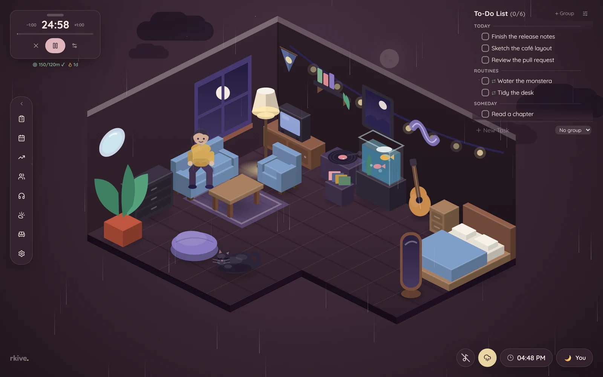 **Rain at night** | 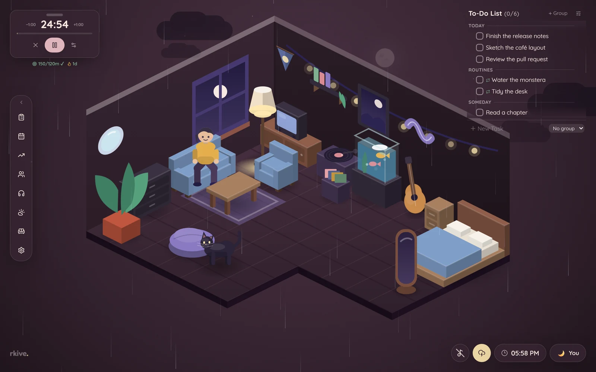 **Storm** — heavy cloud, lightning |
| 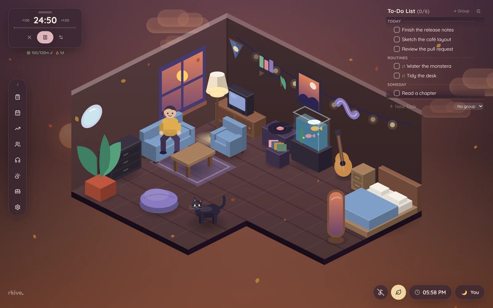 **Falling leaves at sunset** | 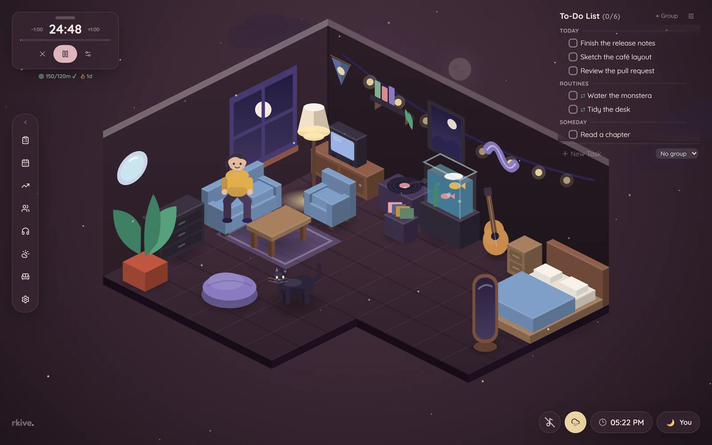 **Snow** |
|  **Cloudy at sunset** | |

## Features

| | |
|---|---|
| 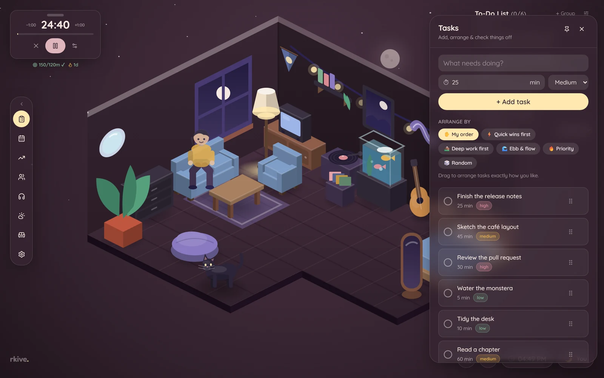 **Tasks** — groups, priorities, durations, routines, five ordering algorithms | 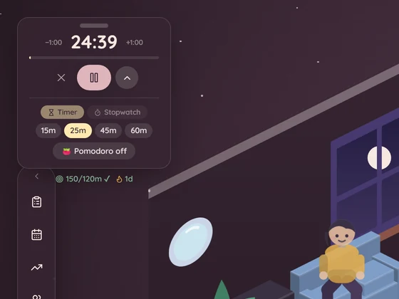 **Focus timer** — durations, Pomodoro, stopwatch, daily goal and streak |
| 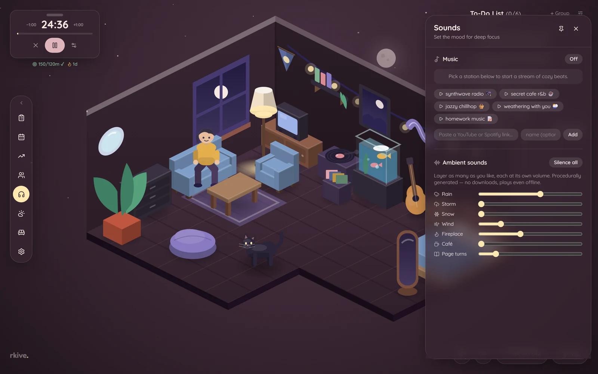 **Sounds** — lofi stations plus a procedural ambient mixer | 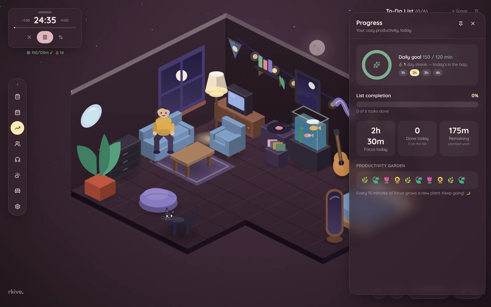 **Progress** — goal ring, focus time, productivity garden |
| 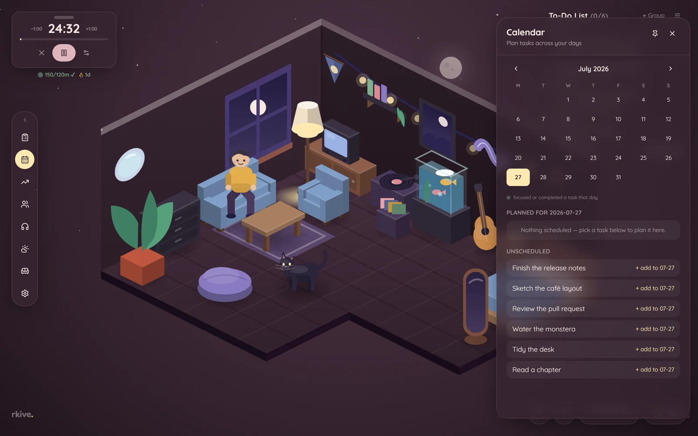 **Calendar** — schedule tasks across days | 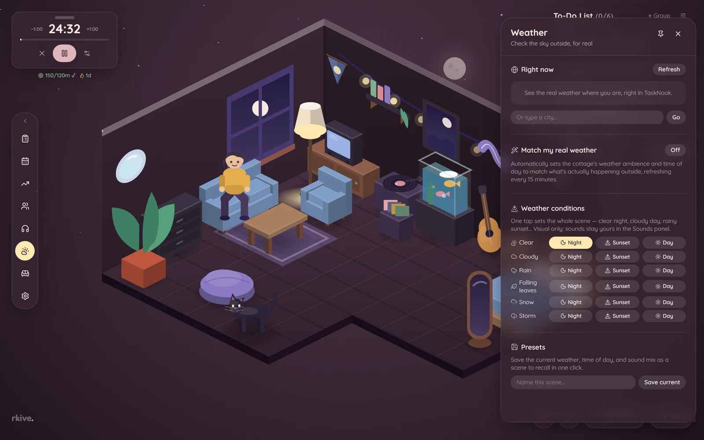 **Weather** — real conditions via Open-Meteo, and the scene matrix |
| 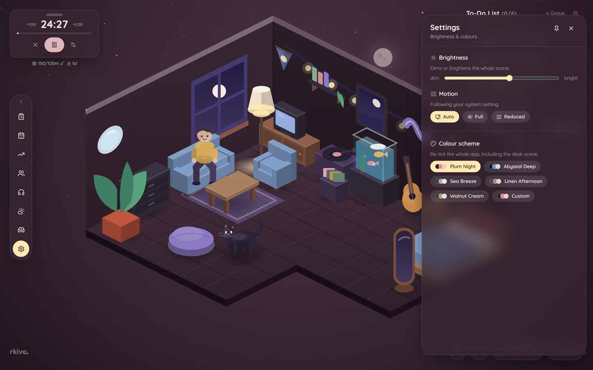 **Settings** — colour schemes, brightness, motion | 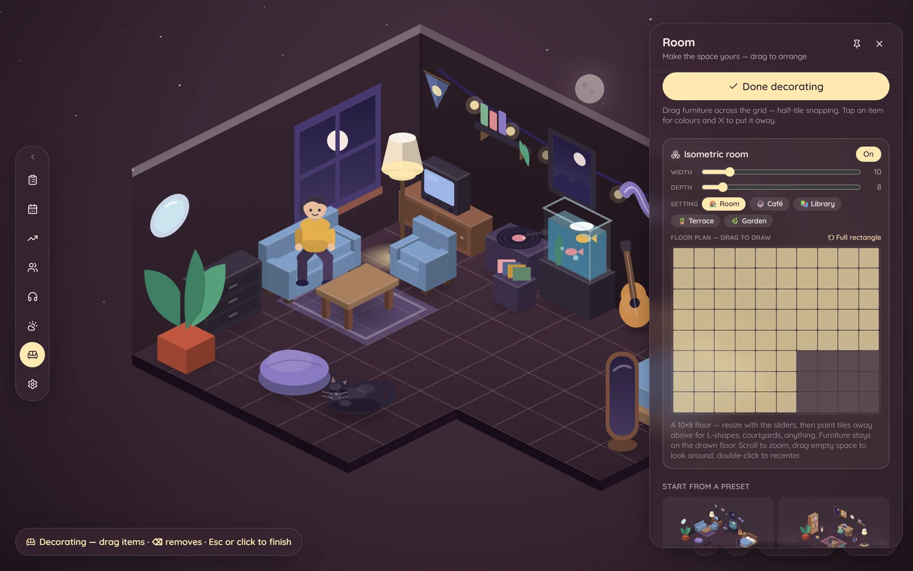 **Decorating** — draw the floor plan, drag furniture, swap the setting |
